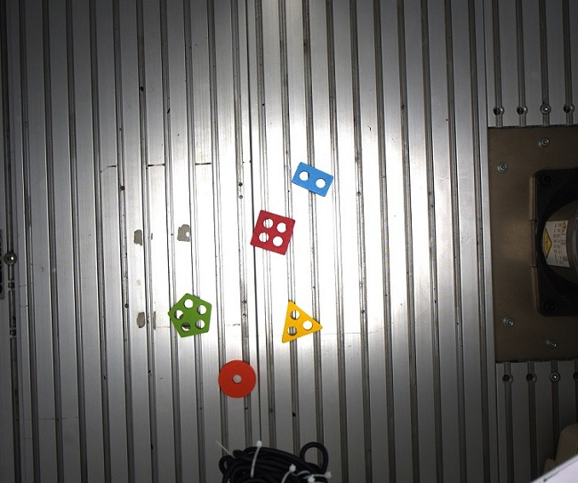

# detection_yolo
### Object detection results using three YOLOv5-based models: 

1. [yolov5](https://github.com/ultralytics/yolov5) - Computes fixed bounding boxes

2. [RotateObjectDetection](https://github.com/XinzeLee/RotateObjectDetection) - Computes rotated bounding boxes

3. [YOLOv5_DOTA_OBB](https://github.com/hukaixuan19970627/YOLOv5_DOTA_OBB) - Computes rotated bounding boxes
---

Models trained on custom shapes dataset of five classes: 

*Circle, Rectangle, Triangle, Square, Pentagon*

